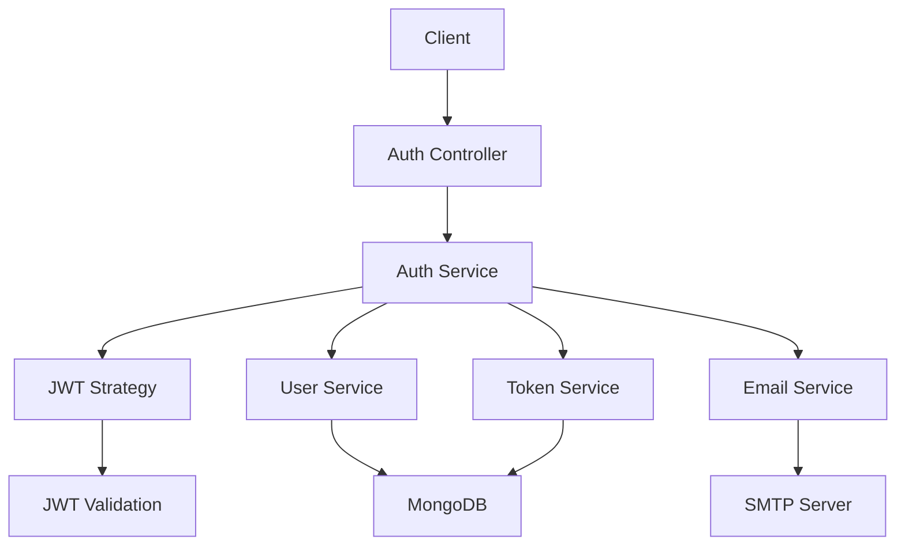
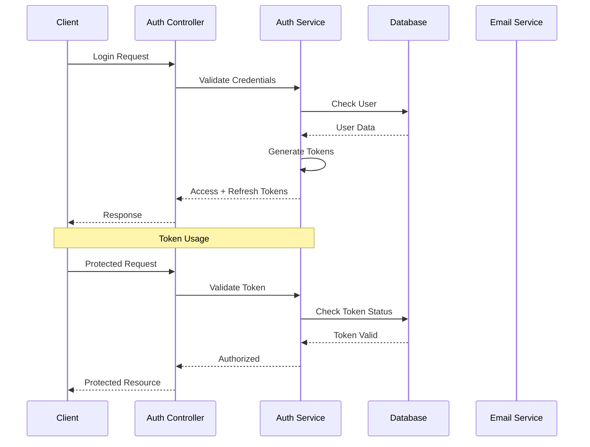
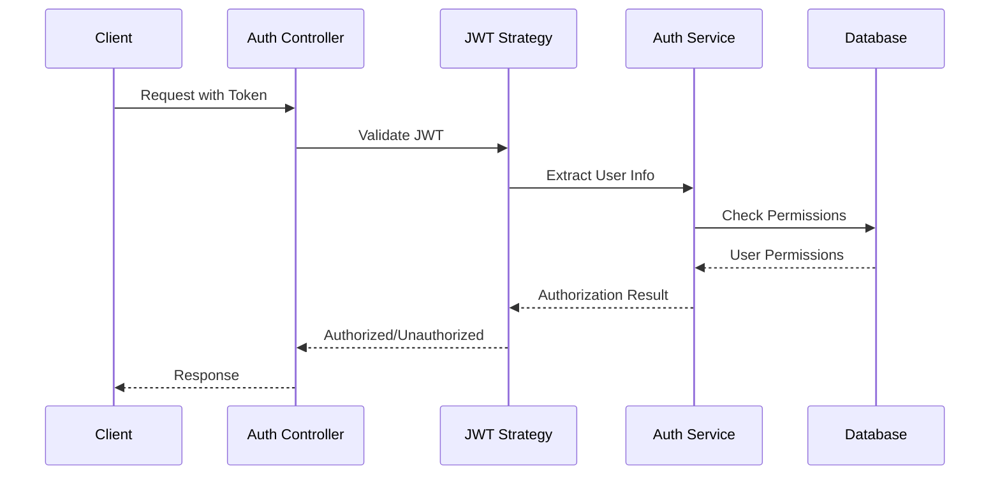

# Authentication and Authorization System Documentation

## System Overview

This document outlines the comprehensive authentication and authorization system implemented in our NestJS application. The system provides a robust, secure, and feature-rich authentication solution with multiple layers of security.

## Architecture Diagram



## Core Features

### 1. Multi-Layer Authentication
- **JWT-Based Authentication**
  - Access tokens for short-term authentication
  - Refresh tokens for long-term session management
  - Token rotation for enhanced security
  - Token revocation capabilities

- **Session Management**
  - Active session tracking
  - Device fingerprinting
  - IP address tracking
  - Session timeout handling

### 2. Security Features
- **Password Security**
  - Bcrypt hashing
  - Password complexity requirements
  - Password reset functionality
  - Rate limiting on login attempts

- **Token Security**
  - JWT with asymmetric encryption
  - Token expiration
  - Refresh token rotation
  - Token blacklisting

### 3. User Management
- **Registration System**
  - Email verification
  - Duplicate email prevention
  - Password validation
  - User profile creation

- **Login System**
  - Multi-factor authentication support
  - Remember me functionality
  - Failed login attempt tracking
  - Account lockout protection

### 4. Email Integration
- **Email Services**
  - Password reset emails
  - Email verification
  - Security notifications
  - Account activity alerts

## Technical Implementation

### Authentication Flow



### Authorization Flow



## API Endpoints

### Authentication Endpoints

1. **User Registration**
```http
POST /auth/signup
Content-Type: application/json

{
  "name": "Test User",
  "email": "test@example.com",
  "password": "Password123!"
}
```

2. **User Login**
```http
POST /auth/login
Content-Type: application/json

{
  "email": "test@example.com",
  "password": "Password123!"
}
```

3. **Token Management**
```http
POST /auth/refresh-token
Content-Type: application/json

{
  "refreshToken": "refresh_token_here"
}
```

### Security Endpoints

1. **Password Reset**
```http
POST /auth/forgot-password
Content-Type: application/json

{
  "email": "test@example.com"
}
```

2. **Session Management**
```http
GET /auth/sessions
Authorization: Bearer access_token_here
```

## Security Features and Benefits

### 1. Token-Based Authentication
- **Advantages:**
  - Stateless authentication
  - Scalable across multiple servers
  - Reduced database load
  - Mobile-friendly

### 2. Refresh Token Rotation
- **Advantages:**
  - Enhanced security through token rotation
  - Ability to revoke compromised tokens
  - Long-term session management
  - Reduced risk of token theft

### 3. Session Management
- **Advantages:**
  - Device tracking
  - Suspicious activity detection
  - Ability to terminate specific sessions
  - Enhanced security monitoring

### 4. Email Integration
- **Advantages:**
  - Secure password reset flow
  - User verification
  - Security notifications
  - Account activity monitoring

## Testing Scenarios

### 1. Authentication Tests
- Registration with valid/invalid data
- Login with correct/incorrect credentials
- Token generation and validation
- Refresh token rotation
- Token revocation

### 2. Security Tests
- Password reset flow
- Session management
- Rate limiting
- Account lockout
- Token expiration

### 3. Authorization Tests
- Role-based access control
- Permission validation
- Resource access control
- Token validation
- Session validation

## Environment Configuration

Required environment variables:
```env
JWT_SECRET=your_jwt_secret
JWT_EXPIRES=1h
REFRESH_TOKEN_EXPIRES=7d
SMTP_HOST=your_smtp_host
SMTP_PORT=587
SMTP_USER=your_smtp_user
SMTP_PASS=your_smtp_password
SMTP_FROM=noreply@yourdomain.com
```

## Best Practices

1. **Token Management**
   - Store tokens securely
   - Implement token rotation
   - Use appropriate expiration times
   - Implement token revocation

2. **Password Security**
   - Use strong password policies
   - Implement rate limiting
   - Hash passwords securely
   - Regular password updates

3. **Session Security**
   - Track active sessions
   - Implement session timeout
   - Monitor for suspicious activity
   - Allow session termination

4. **Error Handling**
   - Secure error messages
   - Proper logging
   - Rate limiting
   - Input validation

## Prerequisites
- [Postman](https://www.postman.com/) or any API testing tool
- The API running locally on `http://localhost:3000`
- MongoDB running and configured

## Environment Setup

Create a Postman environment with these variables:
```json
{
  "baseUrl": "http://localhost:3000",
  "accessToken": "",
  "refreshToken": ""
}
```

## Test Cases

### 1. User Registration

#### 1.1 Register New User
```http
POST {{baseUrl}}/auth/signup
Content-Type: application/json

{
  "name": "Test User",
  "email": "test@example.com",
  "password": "Password123!"
}
```

**Expected Success Response (201 Created)**
```json
{
  "token": "eyJhbG..."
}
```

**Expected Error Cases:**
1. Email Already Exists (409 Conflict)
```json
{
  "statusCode": 409,
  "message": "Email is already in use"
}
```

2. Invalid Password Format (400 Bad Request)
```json
{
  "statusCode": 400,
  "message": ["password must be longer than or equal to 8 characters"]
}
```

### 2. User Login

#### 2.1 Login with Valid Credentials
```http
POST {{baseUrl}}/auth/login
Content-Type: application/json

{
  "email": "test@example.com",
  "password": "Password123!"
}
```

**Expected Success Response (200 OK)**
```json
{
  "accessToken": "eyJhbG...",
  "refreshToken": "a1b2c3..."
}
```

**Expected Error Cases:**
1. Invalid Credentials (401 Unauthorized)
```json
{
  "statusCode": 401,
  "message": "Invalid email or password"
}
```

2. Missing Fields (400 Bad Request)
```json
{
  "statusCode": 400,
  "message": ["email must be an email", "password should not be empty"]
}
```

### 3. Token Management

#### 3.1 Refresh Token
```http
POST {{baseUrl}}/auth/refresh-token
Content-Type: application/json

{
  "refreshToken": "{{refreshToken}}"
}
```

**Expected Success Response (200 OK)**
```json
{
  "accessToken": "eyJhbG...",
  "refreshToken": "d4e5f6..."
}
```

**Expected Error Cases:**
1. Invalid Refresh Token (401 Unauthorized)
```json
{
  "statusCode": 401,
  "message": "Invalid refresh token"
}
```

#### 3.2 Revoke Specific Token
```http
POST {{baseUrl}}/auth/revoke-token
Authorization: Bearer {{accessToken}}
Content-Type: application/json

{
  "tokenId": "token_id_here"
}
```

**Expected Success Response (200 OK)**
```json
{
  "message": "Token revoked successfully"
}
```

**Expected Error Cases:**
1. Token Not Found (404 Not Found)
```json
{
  "statusCode": 404,
  "message": "Token not found"
}
```

#### 3.3 Revoke All Tokens
```http
POST {{baseUrl}}/auth/revoke-all
Authorization: Bearer {{accessToken}}
```

**Expected Success Response (200 OK)**
```json
{
  "message": "All tokens revoked successfully"
}
```

### 4. Password Management

#### 4.1 Request Password Reset
```http
POST {{baseUrl}}/auth/forgot-password
Content-Type: application/json

{
  "email": "test@example.com"
}
```

**Expected Success Response (200 OK)**
```json
{
  "message": "Password reset instructions sent to your email"
}
```

**Expected Error Cases:**
1. User Not Found (404 Not Found)
```json
{
  "statusCode": 404,
  "message": "User not found"
}
```

#### 4.2 Reset Password
```http
POST {{baseUrl}}/auth/reset-password
Content-Type: application/json

{
  "token": "reset_token_from_email",
  "newPassword": "NewPassword123!"
}
```

**Expected Success Response (200 OK)**
```json
{
  "message": "Password successfully reset"
}
```

**Expected Error Cases:**
1. Invalid/Expired Token (401 Unauthorized)
```json
{
  "statusCode": 401,
  "message": "Invalid or expired reset token"
}
```

### 5. Session Management

#### 5.1 Get Active Sessions
```http
GET {{baseUrl}}/auth/sessions
Authorization: Bearer {{accessToken}}
```

**Expected Success Response (200 OK)**
```json
[
  {
    "id": "session_id",
    "userAgent": "Mozilla/5.0...",
    "ipAddress": "127.0.0.1",
    "createdAt": "2024-03-15T10:00:00.000Z",
    "lastUsedAt": "2024-03-15T11:00:00.000Z"
  }
]
```

## Testing Workflow

1. **Initial Setup**
```bash
# 1. Register new user
POST /auth/signup
# Save the token

# 2. Login with user
POST /auth/login
# Save both accessToken and refreshToken
```

2. **Token Lifecycle Testing**
```bash
# 1. Use access token for protected route
GET /auth/sessions

# 2. Wait for access token to expire (15 minutes)

# 3. Try protected route (should fail)
GET /auth/sessions

# 4. Use refresh token to get new tokens
POST /auth/refresh-token

# 5. Verify new tokens work
GET /auth/sessions
```

3. **Security Testing**
```bash
# 1. Try accessing protected route without token
GET /auth/sessions

# 2. Try with invalid token
GET /auth/sessions
Authorization: Bearer invalid_token

# 3. Try with expired token
GET /auth/sessions
Authorization: Bearer expired_token

# 4. Try with revoked token
GET /auth/sessions
Authorization: Bearer revoked_token
```

## Common HTTP Status Codes

- `200 OK`: Successful request
- `201 Created`: Resource successfully created
- `400 Bad Request`: Invalid input data
- `401 Unauthorized`: Missing or invalid authentication
- `403 Forbidden`: Valid authentication but insufficient permissions
- `404 Not Found`: Resource not found
- `409 Conflict`: Resource conflict (e.g., duplicate email)
- `422 Unprocessable Entity`: Validation error
- `500 Internal Server Error`: Server error

## Testing Tips

1. **Token Management**
   - Save tokens in environment variables
   - Update tokens after refresh
   - Clear tokens after logout/revocation

2. **Error Testing**
   - Test all error scenarios
   - Verify error messages
   - Check status codes

3. **Security Testing**
   - Test with invalid tokens
   - Test with expired tokens
   - Test with insufficient permissions

4. **Session Testing**
   - Test multiple device login
   - Test session revocation
   - Test session expiry

## Postman Collection

You can import this collection into Postman:

```json
{
  "info": {
    "name": "Library API Auth Tests",
    "schema": "https://schema.getpostman.com/json/collection/v2.1.0/collection.json"
  },
  "item": [
    {
      "name": "Auth",
      "item": [
        {
          "name": "Register",
          "request": {
            "method": "POST",
            "url": "{{baseUrl}}/auth/signup",
            "body": {
              "mode": "raw",
              "raw": "{\"name\":\"Test User\",\"email\":\"test@example.com\",\"password\":\"Password123!\"}",
              "options": {
                "raw": {
                  "language": "json"
                }
              }
            }
          }
        },
        {
          "name": "Login",
          "event": [
            {
              "listen": "test",
              "script": {
                "exec": [
                  "var jsonData = pm.response.json();",
                  "pm.environment.set('accessToken', jsonData.accessToken);",
                  "pm.environment.set('refreshToken', jsonData.refreshToken);"
                ]
              }
            }
          ],
          "request": {
            "method": "POST",
            "url": "{{baseUrl}}/auth/login",
            "body": {
              "mode": "raw",
              "raw": "{\"email\":\"test@example.com\",\"password\":\"Password123!\"}",
              "options": {
                "raw": {
                  "language": "json"
                }
              }
            }
          }
        }
      ]
    }
  ]
} 